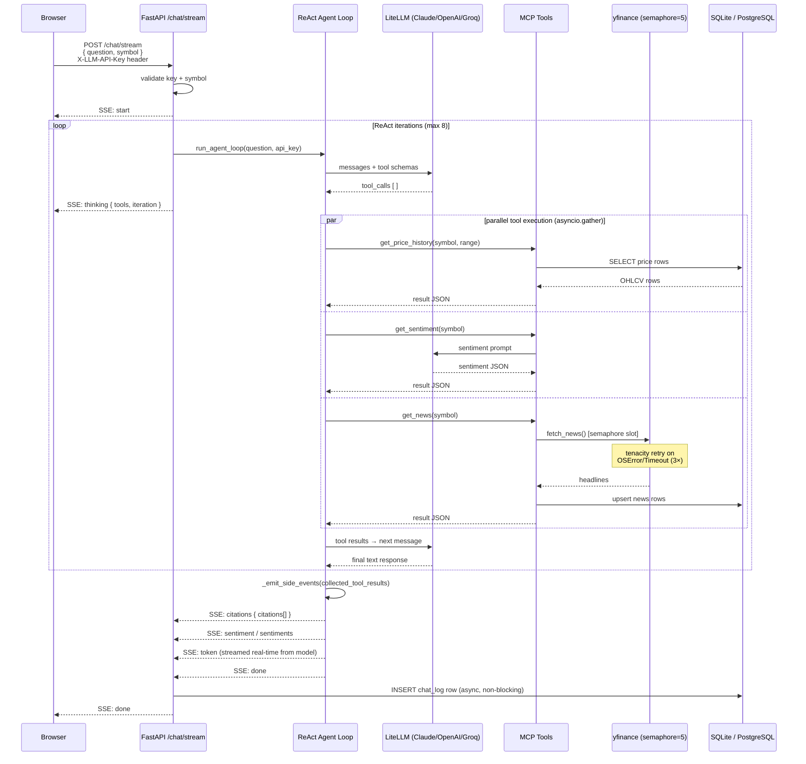

# 📈 InvestorAI MCP

AI-native stock research MCP server for retail investors — 11 tools, BYOK AI chat with SSE streaming, agentic ReAct loop, sentiment analysis, and a React playground dashboard.


---

InvestorAI MCP gives AI assistants structured, grounded access to price history, news, and sentiment for 50 curated blue-chip stocks across 5 sectors. All data comes from a local SQLite cache (or PostgreSQL in production), keeping responses fast and offline-capable. The LLM layer is fully BYOK — bring your own Anthropic, OpenAI, or Groq key. Nothing is ever stored server-side.

## Features

- **Price History** — Daily OHLCV data for 50 stocks, 7 time ranges (1W → 5Y), adjusted close with split/dividend correction
- **Stock Profiles** — Company name, sector, exchange, market cap for every supported ticker
- **News Feed** — Latest headlines cached from yfinance, refreshed on demand
- **AI Trend Summaries** — LLM-generated narrative with inline citations, multi-stock comparison, sector queries, and natural language date ranges
- **Sentiment Analysis** — AI scores recent headlines positive / negative / neutral with reasoning and key themes
- **Semantic Ticker Search** — Fuzzy search by company name, product keyword, or exact symbol (no embeddings required)
- **Natural Language Dates** — Understands "yesterday", "last Wednesday", "May 2023 to January 2025", "last 54 days"
- **BYOK AI Chat** — Bring your own API key (Claude, OpenAI, Groq) — keys stored in browser localStorage only, sent per-request in a header, never persisted server-side
- **Lightweight Query Router** — Classifies every question (meta / single_stock / multi_stock / broad) via regex + symbol detection before the agent loop starts — zero LLM cost, injects a routing hint into the system prompt so the agent picks the right tools upfront
- **Agentic ReAct Loop** — LLM drives all tool orchestration; calls primitive tools in parallel, reasons over results, writes its own narrative
- **Real-time SSE Streaming** — True token streaming direct from the model API (~200–400ms TTFT); live thinking indicator, citation injection, and sentiment events
- **Live Thinking Indicator** — Frontend shows which tools the agent is calling in real time as it reasons
- **Response Validation** — Configurable strict / warm-only LLM output validation, skipped automatically for news-focused queries
- **Playground Dashboard** — DB health, cache status, Langfuse traces, and latency percentiles in a single React pane
- **Langfuse Observability** — Optional LLM tracing, token counting, and latency monitoring with direct trace links
- **Smart Cache** — Stale-while-available with background refresh; `refresh_ticker` for on-demand live pulls
- **MCP Server** — 11 tools via FastMCP, streamable HTTP + stdio for Claude Desktop / Claude Code / VS Code / Cursor
- **Rate Limiting** — SlowAPI-backed per-minute limiting, configurable per deployment
- **CI/CD Pipeline** — GitHub Actions with lint, type-check, security scan, CVE audit, secrets scan, and 80% coverage gate

## Supported Universe

50 stocks across 5 sectors:

| Sector | Count | Tickers |
|---|---|---|
| Technology | 14 | AAPL, MSFT, NVDA, GOOGL, META, AMZN, TSLA, AMD, INTC, ORCL, CRM, ADBE, QCOM, NFLX |
| Finance | 10 | JPM, BAC, GS, MS, V, MA, BRK-B, AXP, WFC, BLK |
| Healthcare | 8 | JNJ, UNH, PFE, ABBV, MRK, LLY, TMO, AMGN |
| Consumer | 10 | WMT, COST, NKE, MCD, SBUX, TGT, HD, DIS, PYPL, SHOP |
| Energy & Industrials | 8 | XOM, CVX, BA, CAT, GE, LMT, NEE, ENPH |

## Quick Start

### Prerequisites

- Python 3.11+
- [uv](https://docs.astral.sh/uv/) (recommended) or pip

### Install

```bash
# Clone and install
git clone https://github.com/danielanojan/investorai-mcp.git
cd investorai-mcp

# Install with uv (recommended)
uv sync

# Or with pip
pip install -e .
```

### Run

```bash
# HTTP mode — MCP endpoint available at http://localhost:8000/mcp
MCP_TRANSPORT=http uv run investorai-mcp

# stdio mode — for Claude Desktop (no HTTP port)
uv run investorai-mcp
```

> **Note:** First startup may take ~30 seconds — LiteLLM downloads model metadata on first run.

The MCP endpoint is available at [http://localhost:8000/mcp](http://localhost:8000/mcp). This is not a browser UI — connect an MCP client (Claude Code, VS Code, Cursor) to that URL.

### React Frontend (optional)

The frontend is a Vite + React app that talks to the FastAPI BFF on port 8000.

**Terminal 1 — FastAPI backend:**

```bash
uvicorn investorai_mcp.server:create_app --factory --port 8000 --reload
```

**Terminal 2 — React dev server:**

```bash
npm --prefix frontend install
npm --prefix frontend run dev
```

Open [http://localhost:5173](http://localhost:5173) — Vite automatically proxies `/api/*` requests to the backend on port 8000.

### Configuration

Create a `.env` file in the project root:

```env
# Data provider
DATA_PROVIDER=yfinance          # yfinance (default) | alpha_vantage | polygon
ALPHA_VANTAGE_KEY=your_key      # required if DATA_PROVIDER=alpha_vantage
POLYGON_KEY=your_key            # required if DATA_PROVIDER=polygon

# LLM — BYOK (web chat reads from browser localStorage; this is for MCP/server-side use)
LLM_PROVIDER=anthropic          # anthropic | openai | groq
LLM_API_KEY=sk-ant-...
LLM_MODEL=claude-sonnet-4-20250514

# Langfuse (optional — LLM observability + playground analytics)
LANGFUSE_PUBLIC_KEY=pk-lf-...
LANGFUSE_SECRET_KEY=sk-lf-...
LANGFUSE_HOST=https://cloud.langfuse.com

# MCP transport
MCP_TRANSPORT=http              # stdio (default) | http
MCP_HTTP_PORT=8000
MCP_HTTP_API_KEY=               # optional bearer token for HTTP transport

# Feature flags
AI_CHAT_ENABLED=true
SERVE_STALE_ONLY=false
VALIDATION_MODE=strict          # strict | warm_only

# Rate limiting
RATE_LIMIT_PER_MIN=60

# Logging
LOG_LEVEL=INFO                  # DEBUG | INFO | WARNING | ERROR
LOG_FORMAT=text                 # text | json

# Database
DATABASE_URL=sqlite+aiosqlite:///./investorai.db   # or postgresql+asyncpg://...

# Server
PORT=8000
HOST=0.0.0.0
```

### Graceful Degradation

InvestorAI starts with whatever is configured. Missing keys disable the corresponding feature — no crashes.

| Config | Available | Notes |
|---|---|---|
| None | Price history, statistics, news, search | Zero-config, all data-only tools work |
| `LLM_API_KEY` | + AI summaries, sentiment analysis, chat | Required for `get_trend_summary`, `get_sentiment` |
| `LANGFUSE_*` | + Observability dashboard | Playground shows traces, latency, token usage |
| `DATABASE_URL` (PostgreSQL) | + Production-grade persistence | Railway sets this automatically via addon |

## MCP Client Setup

InvestorAI exposes 11 MCP tools via two transports:

| Transport | How it works | Best for |
|---|---|---|
| Streamable HTTP (`/mcp`) | Client connects to a running InvestorAI server | Claude Code, VS Code, Cursor |
| stdio | MCP client spawns `investorai-mcp` as a child process | Claude Desktop |

### Claude Desktop ✅ Tested

Claude Desktop uses stdio transport — it spawns `investorai-mcp` as a child process.

Edit `~/Library/Application Support/Claude/claude_desktop_config.json` (macOS) or `%APPDATA%\Claude\claude_desktop_config.json` (Windows):

```json
{
  "mcpServers": {
    "investorai": {
      "command": "uv",
      "args": ["run", "--directory", "/path/to/investorai-mcp", "investorai-mcp"],
      "env": {
        "MCP_TRANSPORT": "stdio",
        "LLM_API_KEY": "sk-ant-..."
      }
    }
  }
}
```

After saving, restart Claude Desktop completely. Look for the tools icon — investorai should appear with 11 tools.

### Claude Code ✅ Tested

Claude Code uses streamable HTTP transport — it connects to a running InvestorAI server.

First, start the server in HTTP mode:

```bash
MCP_TRANSPORT=http uv run investorai-mcp
```

Then register the MCP server:

```bash
claude mcp add investorai --transport http http://localhost:8000/mcp
```

Try asking: *"How has NVDA performed over the last year compared to AMD?"*


| Tool | Description |
|---|---|
| `search_ticker` | Fuzzy semantic search — find any supported ticker by name, keyword, or symbol |
| `get_stock_info` | Company profile — name, sector, exchange, market cap, currency |
| `get_price_history` | Daily OHLCV data for any range (1W / 1M / 3M / 6M / 1Y / 3Y / 5Y) — auto-refreshes stale data |
| `get_price_history_batch` | Same as above for multiple symbols in one call — single DB query, parallel refresh |
| `get_daily_summary` | Pre-computed statistics — return %, high, low, volatility, volume — auto-refreshes stale data |
| `get_daily_summary_batch` | Same as above for multiple symbols in one call — single DB query, parallel refresh |
| `get_news` | Latest news headlines, cached from provider with on-demand refresh |
| `get_sentiment` | AI-scored news sentiment — positive / negative / neutral with reasoning and key themes |
| `get_trend_summary` | AI narrative summary — supports multi-stock, sector queries, natural language dates, SSE streaming |
| `get_cache_status` | Data freshness diagnostics — TTL status, age, error counts per data type |
| `refresh_ticker` | Force live data refresh, bypassing cache TTL (rate-limited: once per 5 min per ticker) |
| `parse_question` | NLP helper — detect symbols, sector, time range, and dates from free-text questions |
| `get_system_info` | Meta questions — which stocks are supported, sectors, today's date |

> **Always use `search_ticker` first** if you're unsure of a ticker symbol. Never guess — only use tickers confirmed by `search_ticker` or `get_stock_info`.

## API Reference

The FastAPI BFF layer serves the React frontend. The same internal service functions back both the REST API and MCP tools.

| Method | Path | Description |
|---|---|---|
| GET | `/health` | Health check |
| GET | `/tickers` | List all 50 supported tickers |
| GET | `/tickers/search?q=` | Search tickers by name / keyword |
| GET | `/stocks/{symbol}/prices` | Price history (range, price_type params) |
| GET | `/stocks/{symbol}/summary` | Statistical summary |
| GET | `/stocks/{symbol}/news` | Recent news articles |
| GET | `/stocks/{symbol}/sentiment` | AI sentiment score |
| GET | `/stocks/{symbol}/cache` | Cache freshness status |
| POST | `/stocks/{symbol}/refresh` | Force live data refresh |
| POST | `/stocks/{symbol}/trend` | AI trend summary (non-streaming) |
| POST | `/chat` | BYOK chat (non-streaming) |
| POST | `/chat/stream` | BYOK chat with SSE streaming |
| POST | `/llm/validate` | Validate an LLM API key |
| GET | `/monitoring/db` | DB health, cache stats, row counts |
| GET | `/monitoring/langfuse` | Langfuse traces and latency |
| GET | `/monitoring/latency` | Request latency percentiles |

### SSE Streaming Events

The `/chat/stream` endpoint emits the following Server-Sent Events:

| Event type | Payload | Description |
|---|---|---|
| `start` | `{ symbol }` | Stream opened |
| `thinking` | `{ tools: string[], iteration: number }` | Agent is calling these tools on this iteration |
| `token` | `{ content }` | Incremental response word — thinking phase is over |
| `citations` | `{ citations: Citation[] }` | Source references extracted from tool results |
| `sentiment` | `{ sentiment: SentimentResult }` | Sentiment for a single stock query |
| `sentiments` | `{ sentiments: Record<symbol, SentimentResult> }` | Sentiment for multi-stock queries |
| `done` | — | Stream complete |
| `error` | `{ message }` | Stream-level error (generic message — details logged server-side) |

## Architecture Overview

InvestorAI is a Python/FastAPI backend with a React + Vite + Tailwind frontend. The same internal service layer is consumed by four surfaces: the REST API (web UI), the MCP server (11 tools for AI clients), the SSE chat stream, and the monitoring endpoints.

**Data flow — MCP tools (Claude Desktop / Claude Code):**
1. **yfinance adapter** fetches OHLCV + news from Yahoo Finance on-demand and persists to SQLite
2. **Cache manager** enforces TTLs per data type (prices vs news), tracks fetch errors, serialises concurrent writes via WAL mode + asyncio locks
3. **MCP tools** query the SQLite cache and return structured results — no LLM needed for price or news lookups
4. **LiteLLM gateway** (`litellm_client.py`) handles all LLM calls — provider-agnostic, supports Claude / OpenAI / Groq via a single BYOK interface
5. **Response validator** checks LLM output against DB-sourced price stats to catch hallucinated numbers
6. **Citation extractor** strips inline source markers from LLM responses and returns structured citation objects
7. **Langfuse** wraps each tool invocation as a span via `lf_span()` context manager — zero-overhead when keys are not configured

**Data flow — BYOK chat (`/api/chat/stream`):**
1. User question + BYOK key arrive at the SSE endpoint
2. **Query router** (`llm/query_router.py`) classifies the question (meta / single_stock / multi_stock / broad) via regex + symbol detection — no LLM call — and injects a routing hint into the system prompt
3. **Agent ReAct loop** (`llm/agent.py`) sends the question to the LLM with 10 primitive tool schemas
4. LLM decides which tools to call — can return multiple tool calls in one turn (parallel execution via `asyncio.gather`)
5. A `thinking` SSE event is emitted immediately so the frontend shows which tools are running
6. Tool results are collected and fed back to the LLM; loop repeats until LLM produces a final text response
7. Final text streamed token-by-token in real time via `acompletion(stream=True)` (~200–400ms TTFT); `citations` and `sentiment`/`sentiments` events emitted before `done`

**Database:** SQLite with aiosqlite (default) or PostgreSQL via asyncpg. Alembic handles schema migrations. Railway's PostgreSQL addon is detected automatically via the `DATABASE_URL` environment variable.

**Frontend:** React 18 + Vite, Tailwind CSS. Components include `PriceChart`, `NewsFeed`, `StatsCard`, `ChatPanel` (with live thinking indicator, `SentimentBadge` + `SentimentBlock`), `TickerSelector`, `BYOKSetup`, and `MonitoringDashboard`. API keys are stored in browser localStorage only — never sent to the server outside of request headers.

## Agent Workflow



## Playground Dashboard

The `/` route serves the React playground — a unified interface for stock research and system observability.

### Stock Research

- **Ticker Selector** — Browse or search the 50-stock universe by name, keyword, or sector
- **Price Chart** — Interactive OHLCV chart with configurable time range
- **Stats Card** — Period return, high/low, volatility, trading days
- **News Feed** — Latest headlines with source links
- **AI Chat Panel** — BYOK chat with SSE streaming; shows live thinking indicator (which tools the agent is calling), inline sentiment badges (▲ positive / ▼ negative / ● neutral), and source citations

### Monitoring Dashboard

Accessible from the playground header:

- **DB Health** — Table row counts, cache hit/miss, last refresh timestamps per ticker
- **Langfuse Traces** — Last 20 LLM traces with latency, token counts, and direct "View ↗" links to the full Langfuse span tree
- **Latency** — p50 / p95 / p99 request latency across all chat endpoints

Langfuse sections are hidden gracefully when keys are not configured.

## CI/CD Pipeline

GitHub Actions runs on every push and pull request to `dev` and `main`:

| Step | Tool | Gate |
|---|---|---|
| Secret scan | gitleaks (full history) | Warn |
| Lint | ruff | **Hard block** |
| Type check | mypy | Warn (graduating to hard) |
| Security scan | bandit | Warn |
| Dependency CVE audit | pip-audit | Warn |
| Unit tests + coverage | pytest `--cov-fail-under=80` | **Hard block** |
| Coverage artifact | actions/upload-artifact | Always uploaded |

The `secrets` job runs in parallel with the `test` job — no dependency install needed, faster feedback on secret leaks.

Coverage gate is also enforced locally via `pyproject.toml` addopts, so `uv run pytest` fails below 80% everywhere.

Pre-commit hooks also run locally on every `git commit`: gitleaks, ruff lint+fix, ruff-format, trailing whitespace, end-of-file, yaml/toml checks. Configured in `.pre-commit-config.yaml` — shared across contributors via version control.

## Development

### Setup

```bash
git clone https://github.com/danielanojan/investorai-mcp.git
cd investorai-mcp
uv sync --group dev     # install all dependencies including dev
cp .env.example .env    # add your API keys
```

### Run tests

```bash
uv run pytest tests/unit/                          # unit tests only (468 tests)
uv run pytest tests/unit/ --cov=investorai_mcp     # with coverage report
uv run pytest                                       # full suite
```

Coverage gate: 85% minimum enforced locally via `pyproject.toml`.

### Lint

```bash
uv run ruff check .           # check
uv run ruff check . --fix     # auto-fix
```

Always run lint clean before committing.

### Start dev server

```bash
uv run investorai-mcp
# Frontend dev server (hot reload)
cd frontend && npm install && npm run dev
```

The backend runs on port 8000; the Vite dev server proxies API calls from port 5173.

### Project Structure

```
investorai_mcp/
├── server.py           # FastMCP server + FastAPI app factory
├── config.py           # Pydantic settings (loaded from .env)
├── stocks.py           # Single source of truth for the 50-stock universe
├── calendar.py         # US market calendar — trading hours, holidays
├── tools/              # MCP tools (11 @mcp.tool() decorated functions)
├── api/                # FastAPI router, rate limiting, error handlers
├── data/               # Data adapters (yfinance, alpha_vantage, polygon)
├── db/                 # SQLAlchemy models, Alembic migrations, cache manager
└── llm/                # LiteLLM client, agent loop, query router, Langfuse tracing, validator, citations
frontend/
└── src/
    ├── components/     # React UI — ChatPanel, PriceChart, MonitoringDashboard…
    └── hooks/          # useChat (SSE), useBYOK
tests/
├── unit/               # 468 tests, 85% coverage — tools, agent loop, router, models
└── evals/              # Eval pairs for offline LLM quality benchmarking
.github/
└── workflows/
    └── ci.yml          # Lint · Type · Security · CVE · Tests · Secrets
```

## Architectural Decisions

| Decision | Approach | Rationale |
|---|---|---|
| 50-stock curated universe | Hardcoded in `stocks.py` | Eliminates hallucinated tickers. Every response grounded in supported symbols. `search_ticker` bridges natural language to exact symbols |
| ReAct agentic loop | LLM drives tool orchestration via `tool_calls` | LLM reasons about what to fetch, skips unnecessary tools, calls multiple tools per turn in parallel |
| Cache-first, refresh-on-demand | SQLite cache with TTL + `refresh_ticker` | p95 latency under 200ms for price lookups. LLM latency dominates; DB is never the bottleneck |
| LiteLLM as LLM gateway | Unified API for Claude, OpenAI, Groq | Single tool-calling implementation supports all major providers — swap `LLM_PROVIDER` without code changes |
| BYOK security model | API keys in browser localStorage only | Keys never touch the server at rest — sent per-request in `X-LLM-API-Key` header, never logged, never persisted. Request-scoped, never written to global state |
| SSE event types | `thinking`, `token`, `citations`, `sentiment`, `done` | Frontend reflects every phase: which tools are running, when writing starts, what sources were used |
| Token budget in agent loop | Hard abort at 180k tokens, warn at 150k | Prevents silent context truncation and runaway LLM costs on broad queries |
| Session hash includes api_key | First 16 chars of key hashed with symbol+date | Different users get distinct Langfuse sessions — api_key is the only user signal in a BYOK system |
| Error sanitization | `logger.exception()` server-side, generic message to client | Internal details (stack traces, DB strings, provider errors) never reach the browser |
| SQLite default, PostgreSQL optional | Detected via `DATABASE_URL` | Zero-config local development. Railway's PostgreSQL addon is a one-click upgrade for production |
| Per-symbol + global write lock | Two-layer asyncio locking + WAL mode | Per-symbol lock prevents duplicate refreshes; global lock serialises SQLite writes; WAL provides OS-level retry safety |
| FastMCP dual transport | Streamable HTTP (`/mcp`) + stdio mode | HTTP for remote/web clients, stdio for local desktop clients (Claude Desktop) |
| Langfuse opt-in via `lf_span` | Context manager, no-op when unconfigured | Zero overhead in deployments without Langfuse keys — same code path, observability added by setting two env vars |
| Batch tools for multi-stock queries | `get_daily_summary_batch`, `get_price_history_batch` with `WHERE symbol IN (...)` | One LLM tool call + one DB query for N stocks instead of N calls. Prevents context window exhaustion and rate limiting at scale |
| Smart refresh — never return data errors | `get_stale_or_missing` check + `refresh_prices_standalone` before serving | Missing or stale data is refreshed synchronously before the response. Tools never return `DATA_UNAVAILABLE` errors — always serve data or a graceful note |
| Standalone refresh classmethod | Own session per symbol, per-symbol lock + global write lock | Safe for `asyncio.gather` parallel refresh calls. Reusing a shared session across concurrent coroutines causes conflicts |
| Lightweight query router | Regex + symbol detection before agent loop, injects hint into system prompt | Zero LLM cost, zero latency — nudges the agent to pick the right tool strategy upfront (batch vs. targeted, meta vs. data query) without hard-constraining it |
| Real streaming TTFT | `acompletion(stream=True)` in final answer turn, text suppressed on tool-call turns | First token reaches the browser in ~200–400ms instead of after a full round-trip (~2–4s). Tool-use logic unchanged — `stream_chunk_builder` reconstructs the full response for tool_calls and usage stats |
| Input sanitization (`api/sanitize.py`) | Regex format check on symbols, length cap on questions, model allowlist | Defense-in-depth before the ORM layer. Rejects malformed input at the boundary — SQL-like strings, oversized payloads, and unknown model IDs never reach the DB or LLM |

## Data Sources

| Source | Data | Key required | Method |
|---|---|---|---|
| Yahoo Finance (yfinance) | OHLCV price history, news headlines, company info | None | HTTP (cached to SQLite) |
| Alpha Vantage | Price history (alternative) | `ALPHA_VANTAGE_KEY` | HTTP (on-demand) |
| Polygon.io | Price history (alternative) | `POLYGON_KEY` | HTTP (on-demand) |
| LiteLLM | LLM routing — Claude, OpenAI, Groq | `LLM_API_KEY` (BYOK) | HTTP (per chat request) |
| Langfuse | LLM observability + trace analytics | `LANGFUSE_PUBLIC_KEY` + `LANGFUSE_SECRET_KEY` | OTEL callbacks + REST reads |

> yfinance is the default and requires no API key. Alternative providers are hot-swappable via `DATA_PROVIDER` without changing any tool code.

## Roadmap

| Item | Status |
|---|---|
| 50-stock universe with 5 sectors | ✅ Done |
| Price history (7 time ranges, adj close) | ✅ Done |
| News feed with on-demand refresh | ✅ Done |
| AI trend summary with citations | ✅ Done |
| Multi-stock comparison queries | ✅ Done |
| Sector-wide queries | ✅ Done |
| Natural language date parsing | ✅ Done |
| AI sentiment analysis | ✅ Done |
| BYOK AI chat with SSE streaming | ✅ Done |
| Agentic ReAct loop for BYOK chat | ✅ Done |
| Live thinking indicator (which tools are running) | ✅ Done |
| Citations + sentiment SSE events | ✅ Done |
| Playground dashboard | ✅ Done |
| Langfuse observability | ✅ Done |
| Response validation (hallucination guard) | ✅ Done |
| Unit test suite (410 tests, 82% coverage) | ✅ Done |
| CI/CD pipeline (lint, type, security, CVE, secrets, coverage) | ✅ Done |
| Claude Desktop MCP integration | ✅ Tested |
| Claude Code MCP integration | ✅ Tested |
| Railway deployment (PostgreSQL) | ✅ Done |
| tenacity retries on yfinance adapter | ✅ Done |
| `asyncio.timeout` on `/chat/stream` | ✅ Done |
| Real health check (DB ping + LLM reachability) | ✅ Done |
| Batch tools for multi-stock queries (single DB query, parallel refresh) | ✅ Done |
| Smart refresh — never return data errors, always serve fresh data | ✅ Done |
| Pre-commit hooks (ruff, ruff-format, gitleaks, whitespace, yaml/toml) | ✅ Done |
| Lightweight query router (regex + symbol detection, no LLM call) | ✅ Done |
| Real streaming TTFT (~200–400ms, `acompletion(stream=True)`) | ✅ Done |
| Doom loop detection (fingerprint repeated tool calls, abort early) | ✅ Done |
| Input sanitization (symbol format, question length cap, model allowlist) | ✅ Done |
| Structured JSON logging | 🔜 Planned |
| Integration tests | 🔜 Planned |
| VS Code + GitHub Copilot MCP integration | 🔜 Planned |
| Cursor MCP integration | 🔜 Planned |
| RAG for historical news context | 🔜 Planned |
| LLM evaluation suite (offline hallucination scoring) | 🔜 Planned |
| Real-time quotes (WebSocket) | 🔜 Planned |
| Earnings calendar integration | 🔜 Planned |
| Expand universe beyond 50 stocks | 🔮 Future |
| Technical indicators (RSI, MACD, Bollinger) | 🔮 Future |

## Contributing

InvestorAI MCP is open source under the Apache 2.0 license. Contributions are welcome:

- 🐛 **Bug reports** — Open an issue with reproduction steps
- 💡 **Feature requests** — Suggest ideas via GitHub Issues
- 🔧 **Pull requests** — Especially welcome for:
  - Additional data provider adapters
  - New MCP tools
  - Test coverage improvements
  - Frontend components

## Disclaimer

InvestorAI MCP is an educational project demonstrating real-time financial data integration, [Model Context Protocol (MCP)](https://modelcontextprotocol.io/) tool-calling patterns, and BYOK AI chat for retail investors.

- Price data is sourced from Yahoo Finance via yfinance. Accuracy and availability are not guaranteed.
- AI-generated summaries and sentiment scores are for informational purposes only and should not be used as sole sources for investment decisions.
- BYOK API keys are stored in browser localStorage only — never persisted server-side.
- This project is not affiliated with any financial institution, brokerage, or data provider.

**Nothing in this project constitutes financial advice.**

## License

Apache 2.0 — see [LICENSE](LICENSE) for details.
